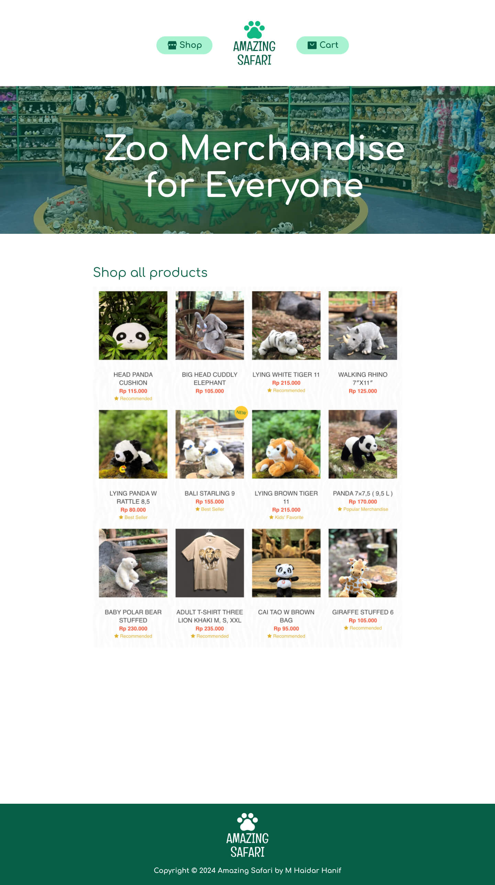

# Amazing Safari

Amazing Safari online store for zoo animals merchandise

Table of Contents:

- [Amazing Safari](#amazing-safari)
  - [Links](#links)
  - [Features](#features)
  - [UI Designs](#ui-designs)
    - [Home Page](#home-page)

## Links

- Website: <https://amazingsafari.haidar.dev>
- UI/UX Design: <https://figma.com>

Inspirations:

- <https://safariwonders.com>
- <https://tamansafari.com>
- <https://stlzoo.org/services/gift-shops/zoo-merchandise>

## Features

- Home page
  - Hero section
  - Products catalogue. Example: <https://safariwonders.com/product-animal>
- Product page
  - Image
  - SKU (stock keeping unit)
  - Name
  - Price
  - Description
  - Add to cart form: quantity input & add to cart button
- Shopping cart page
  - Product items to buy
    - Image, name, price, quantity, total (price x quantity)
    - Remove item
  - Link: continue shopping, go to products catalogue
  - Link: checkout
- Checkout page
  - Order summary
    - Product items to buy
    - Grand total of all product items to buy
- Place order / transaction is being processed

## UI Designs

- Figma: <https://www.figma.com/design/TC8pwzy5HpWoFAQWJpN6IJ/amazingsafari.haidar.dev>

### Home Page

